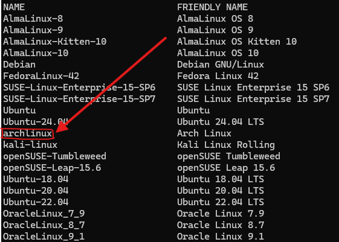

La primera vez que intenté instalar ArchLinux me tomó más de 2 semanas (básicamente mis vacaciones de la Uni), cometí muchos errores, generé múltiples kernel panics, rompía y reparaba en la medida que iba aprendiendo de Linux.

Luego de eso empecé a usar ArchLinux como entorno principal. Cambiaba el entorno de escritorio (Gnome, KDE Plasma, Cinamon, etc) a cada rato, aprendí que se puede usar un gestor de sesión diferente al del entorno de escritorio[^entorno], llegué a dejar de tener imagen gráfica incluso[^sin-graficos] (jejeje)...

... Y me divertí un montón.

Decidí crear este blog luego de darme cuenta de que WSL2 ya soporta ArchLinux y pues por los viejos tiempos de cuando usaba ArchLinux.



## ¿Por qué ArchLinux?


ArchLinux es una distribución de Linux del tipo Rolling Release[^rolling-release], el cual los paquetes son actualizados de forma frecuente permitiendo acceder a paquetes en su versión más reciente de la comunidad que mantiene ese software, tanto para lo bueno (tener las últimas funciones) como para lo malo (posibles fallas).

Esta distribución se ha caracterizado por ser retadora y requerir una gran cantidad de configuraciones para poder tener la distribución en perfecto funcionamiento. Esto permite que además de personalizar a tu gusto cuáles paquetes quieres en tu sistema, también te permite conocer a fondo cómo funciona GNU/Linux. Si te gustaría profundizar tus conocimientos en Linux, usar ArchLinux es excelente opción.

Un último punto de esta distribución Linux es que cuenta con la [ArchWiki](https://wiki.archlinux.org/title/Main_page), una de las Wikis más completas que existe en cuanto a distribuciones Linux. En más de una ocasión he leído en diferentes blogs "si no está en la ArchWiki es porque no existe".

## Instalación de ArchLinux en WSL2

Empezaremos instalando Arch en WSL2 para ello, usando PowerShell:
```Bash
wsl --install -d archlinux
```

## Actualizar ArchLinux e instalar algunos paquetes

Una vez instalado ArchLinux en WSL automáticamente entrará en Bash de esa distribución. Allí procedermos a actualizar los paquetes e instalar `git` y `curl` que usaremos en la configuración.

```Bash
# Actualizar pacman
pacman -Syyu

# Instalar paquetes adicionales
pacman -S git curl
```

Crearemos el password para el usuario root:
```Bash
passwd
```

:::{.callout-note}

## La contraseña no se mostrará en la medida que escribas.

Presiona la tecla ENTER una vez lo hagas te pedirá que la insertes nuevamente  y si coinciden la registrará.
:::


Instalar zsh (es opcional, pero es una shell alternativa a bash interesante que por cierto viene instalada por defecto en MacOS)
```Bash
pacman -S zsh
```

Crear y configurar sudo[^jason-charney]
```Bash
# Instalar el comando sudo (sirve para tener permisos root)
pacman -S sudo

# Crear el grupo sudo
groupadd sudo

# Agregar las siguientes líneas al archivo sudoers
## Si entras al archivo /etc/sudoers encontrarás que estas líneas pero comentadas
echo "%wheel ALL=(ALL) NOPASSWD: ALL" >> /etc/sudoers
echo "%sudo ALL=(ALL) ALL" >> /etc/sudoers
```

:::{.callout-note}

Recuerda reemplazar `my_username` por el nombre de usuario de tu preferencia.
:::

Crear tu usuario[^id100]
```Bash
# Crear el usuario
## Si usas bash, reemplaza /bin/zsh por /bin/bash
useradd -m -G wheel,sudo -s /bin/zsh my_username

# Asignar contraseña al usuario que creaste
passwd my_username
```

Configurar para que el usuario que creaste sea el por defecto[^arch-default-user]
```Bash
# Hacer que el usuario que creaste sea el por defecto
## Si no lo haces, cada vez que entres a ArchLinux iniciará con el usuario root
echo -e "\n[user]\ndefault=my_username" >> /etc/wsl.conf
```

::: {.callout-tip}
## Definir el usuario por defecto desde PowerShell

```Bash
wsl --manage archlinux --set-default-user my_username
```
:::


Configuración de ohmyzsh[^ohmyzsh], paso opcional, pero le dará un toque a tu `zsh`.
```Bash
# Instalar y configurar ohmyzsh
## Al final te preguntará si quieres hacer zsh la shell por defecto
sh -c "$(curl -fsSL https://raw.githubusercontent.com/ohmyzsh/ohmyzsh/master/tools/install.sh)"
```

Instalación y configuración de Docker[^docker]
```Bash
# Instalar docker y docker-compose
sudo pacman -S docker docker-compose

# Habilitar el servicio de docker
sudo systemctl start docker.service
sudo systemctl enable docker.service

# Añadir el usuario creado para que use Docker sin requerir `sudo`
sudo usermod -aG docker $USER
newgrp docker # Refrescar el grupo docker

# Probar que Docker ha quedado instalado correctamente
docker run hello-world
```

Si te gusta ejecutar modelos de LLM locales o si trabajas con DeepLearning (Pytorch o Tensorflow) te será muy útil configurar la GPU con Docker[^docker-gpu]
```Bash
# Instalar Nvidia Container Toolkit
sudo pacman -S nvidia-container-toolkit

# Reiniciar el servicio de docker
sudo systemctl restart docker.service

# Probar que funcione correctamente
## El output mostrará la información de la tarjeta nvidia que tienes en tu PC
docker run --gpus all nvidia/cuda:12.1.1-runtime-ubuntu22.04 nvidia-smi
```

## Notas finales

- Es muy raro que la instalación de ArchLinux se rompa una vez ya esté configurado.
- Instalar y configurar Arch en WSL2 es mucho más fácil que instalarlo nativo en PC.
- Con WSL2 puedes acceder a CLIs de Windows desde Arch y cualquier otra distro instalada en WSL2 usando su extensión _.exe_ como por ejemplo _calibre.exe_.
- Hay problemas con aplicaciones gráficas instaladas desde Arch[^wslg-note] pero se puede hacer un fix de eso[^arch-wslg] aunque no lo he intentado.
- Este artículo en particular fue escrito en ArchLinux usando WSL2 (en solo un par de horas lo instalé y configuré, antes me tomaba días).


<!-- Foot notes -->

[^rolling-release]: <https://en.wikipedia.org/wiki/Rolling_release#Model>
[^ohmyzsh]: <https://github.com/ohmyzsh/ohmyzsh>
[^docker]: <https://itsfoss.com/install-docker-arch-linux/>
[^docker-gpu]: <https://wiki.archlinux.org/title/Docker#Run_GPU_accelerated_Docker_containers_with_NVIDIA_GPUs>
[^arch-wslg]: <https://wiki.archlinux.org/title/Install_Arch_Linux_on_WSL#Run_graphical_applications_with_WSLg>
[^jason-charney]: <https://dev.to/jrcharney/how-to-install-arch-linux-for-wsl-184a>
[^id100]: <https://gist.github.com/ld100/3376435a4bb62ca0906b0cff9de4f94b>
[^arch-default-user]: <https://wiki.archlinux.org/title/Install_Arch_Linux_on_WSL#Set_default_user>
[^wslg-note]: Desde WSL2 las aplicaciones con interfaz gráfica instalada desde Linux se pueden ver desde Windows.
[^entorno]: se veía muy extraño por cierto.
[^sin-graficos]: con ello aprendí que Linux tiene varias terminales TTY y que es en una de ellas donde se usa para renderizar los gráficos del entorno de escritorio que curiosamente solía ser el TTY7.
